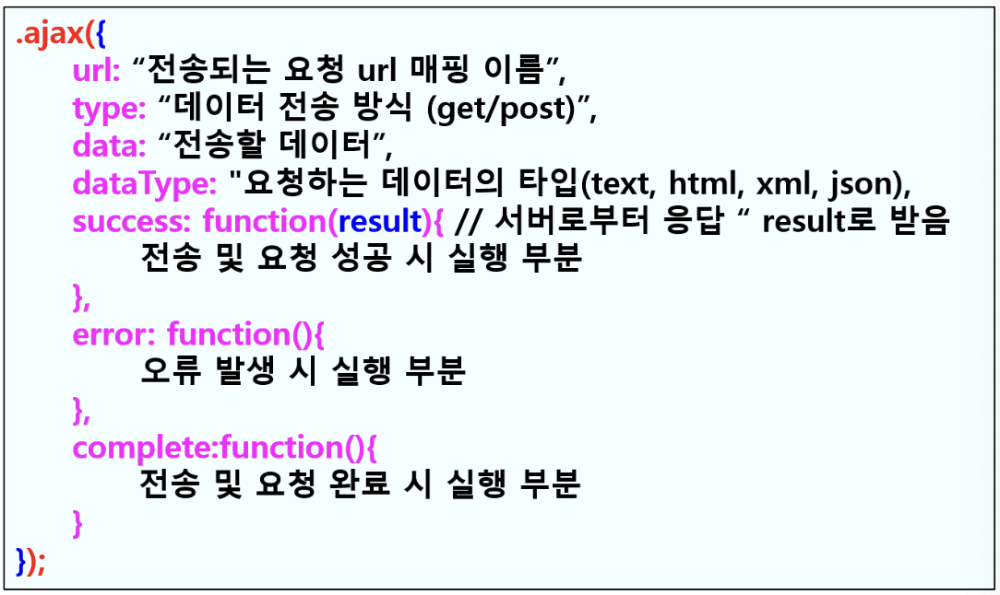

# Ajax

> Asynchronous JavaScript and XML<br>
> 자바스크립트를 이용해서 [비동기식](../Network/SynchronousAsynchronous.md)으로 XML을 이용하여 서버와 통신하는 방식

- 클라이언트에서 비동기 방식으로 자바스크립트를 이용하여 화면 전환없이 서버 측에 데이터를 요청할 때 사용
- TEXT, HTML, XML, JSON 등의 데이터 처리 가능
- 웹 서버 환경에서 실행

## 장점

- 데이터를 빠르고 부드럽게 받을 수 있다.

## 관련 메소드

| 메소드                       | 설명                                                                                                                                                                                                    |
| ---------------------------- | ------------------------------------------------------------------------------------------------------------------------------------------------------------------------------------------------------- |
| load()                       | 외부 콘텐츠 가져올 때 사용                                                                                                                                                                              |
| [**$.ajax()**](#ajax-메소드) | 데이터를 서버에 HTTP POST, GET 방식으로 전송 가능<br>HTML,XML,JSON, 텍스트 유형의 데이터를 요청할 수 있는 통합적인 메소드<br>`$.get()`, `$.post()`, `$.getJSON()` 메소드의 기능을 하나로 합쳐 놓은 기능 |
| $.post()                     | 데이터를 서버에 HTTP POST 방식으로 전송 후 서버 측의 응답을 받을 때 사용                                                                                                                                |
| $.get()                      | 데이터를 서버에 HTTP GET 방식으로 전송 후 서버 측의 응답을 받을 때 사용                                                                                                                                 |
| $.getJSON()                  | 데이터를 서버에 HTTP GET 방식으로 전송 후 응답을 JSON 형식으로 받을 때 사용                                                                                                                             |
| $.getScript()                | Ajax를 이용하여 외부 자바스크립트 불러올 때 사용                                                                                                                                                        |

| 메소드                        | 설명                                                                                                  |
| ----------------------------- | ----------------------------------------------------------------------------------------------------- |
| .ajaxStop(function(){...})    | 비동기 방식으로 서버에 응답 요청이 완료되었을 때 함수의 실행문 수행                                   |
| .ajaxSuccess(function(){...}) | Ajax 요청이 성공적으로 완료되면 함수의 실행문 수행                                                    |
| **serialize()**               | 폼에 입력된 값을 쿼리 스트링 방식의 데이터로 변환하여 액션 페이지에 전송<br>(ex: `id=abcd&pass=1234`) |
| serializeArray()              | 폼에 입력된 값을 JSON 데이터로 변환하여 액션 페이지에 전송<br> (ex: `key1:value1`, `key2,value2`...)  |
| ajaxComplete(function(){...}) | Ajax 통신이 완료되면 함수의 실행문이 실행                                                             |

## $.ajax() 메소드

- 사용자가 지정한 URL 경로에 있는 파일의 데이터를 전송하고
- 입력한 URL 경로의 파일로부터 요청한 데이터를 불러오는데 사용
- 불러올 수 있는 외부 데이터는 텍스트, HTML, XML, JSON 유형 등 다양



```js
$.ajax({
  // URL은 필수 요소이므로 반드시 구현해야 하는 Property입니다.
  url: "url", // 요청이 전송될 URL 주소
  type: "POST", // http 요청 방식 (default: ‘GET’)
  async: true, // 요청 시 동기화 여부. 기본은 비동기(asynchronous) 요청 (default: true)
  cache: true, // 캐시 여부
  timeout: 3000, // 요청 제한 시간 안에 완료되지 않으면 요청을 취소하거나 error 콜백을 호출.(단위: ms)
  data: { key: value }, // 요청 시 포함되어질 데이터
  processData: true, // 데이터를 컨텐트 타입에 맞게 변환 여부
  contentType: "application/json", // 요청 컨텐트 타입
  dataType: "json", // 응답 데이터 형식 (명시하지 않을 경우 자동으로 추측)
  beforeSend: function () {
    // XHR Header를 포함해서 HTTP Request를 하기전에 호출됩니다.
  },
  success: function (data, status, xhr) {
    // 정상적으로 응답 받았을 경우에는 success 콜백이 호출되게 됩니다.
    // 이 콜백 함수의 파라미터에서는 응답 바디, 응답 코드 그리고 XHR 헤더를 확인할 수 있습니다.
  },
  error: function (xhr, status, error) {
    // 응답을 받지 못하였다거나 정상적인 응답이지만 데이터 형식을 확인할 수 없기 때문에
    // error 콜백이 호출될 수 있습니다.
    // 예를 들어, dataType을 지정해서 응답 받을 데이터 형식을 지정하였지만,
    // 서버에서는 다른 데이터형식으로 응답하면  error 콜백이 호출되게 됩니다.
  },
  complete: function (xhr, status) {
    // success와 error 콜백이 호출된 후에 반드시 호출됩니다.
    // try - catch - finally의 finally 구문과 동일합니다.
  },
});
```

---

# 참고

- MLP 강의 노트
- [Ajax 란? (2017)](https://devyj.tistory.com/1)
- [jQuery Ajax (2014)](https://opentutorials.org/course/1375/6851)
