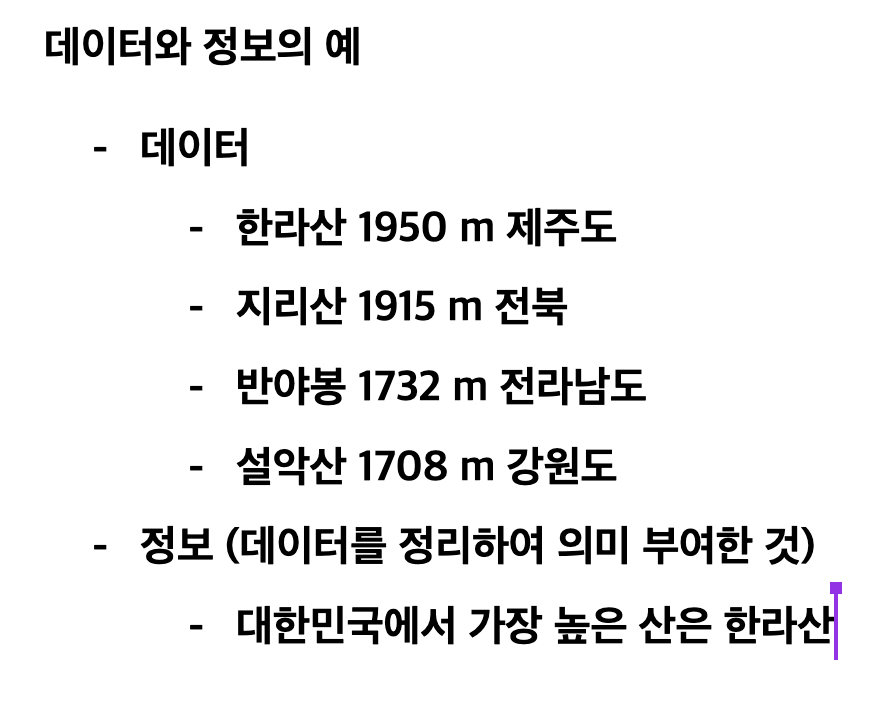
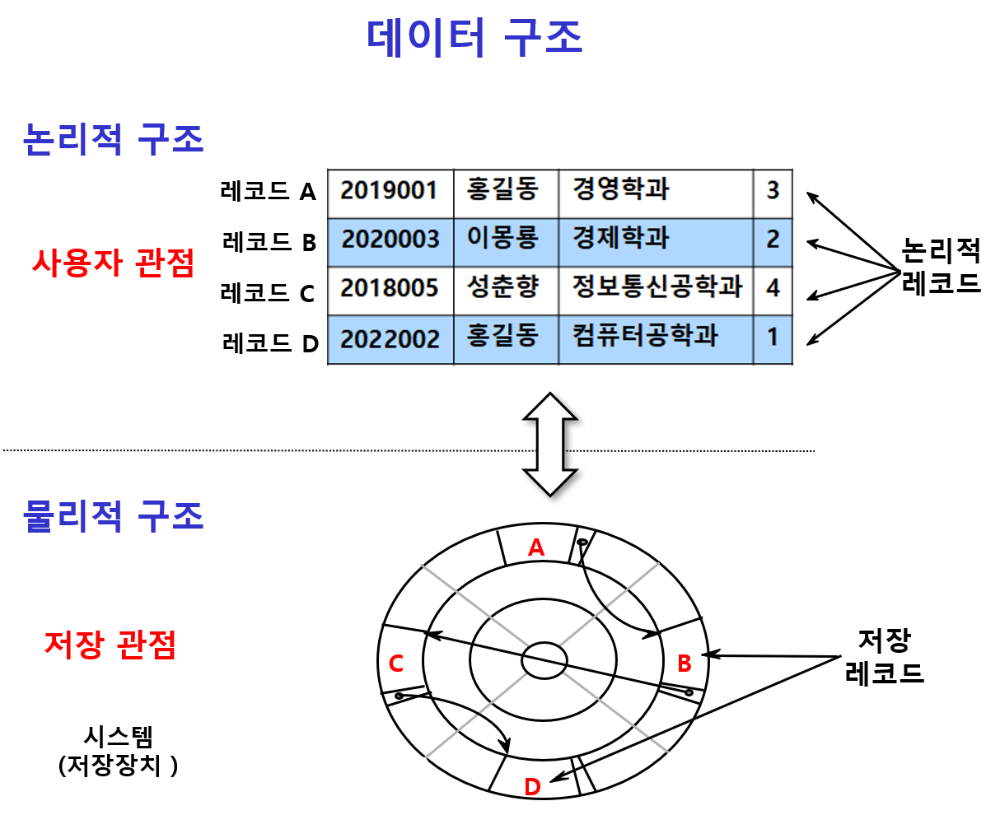
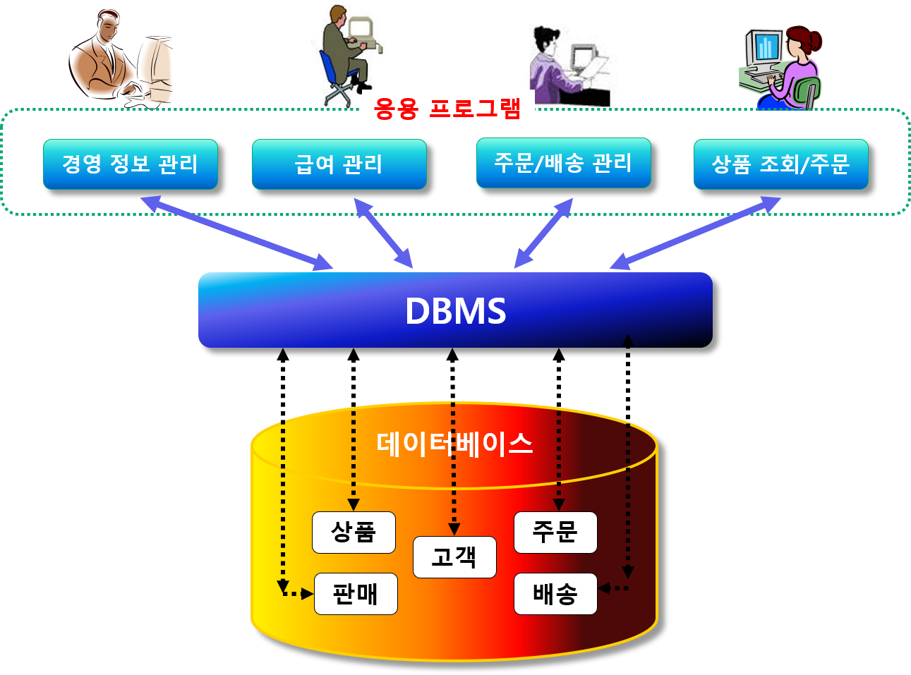
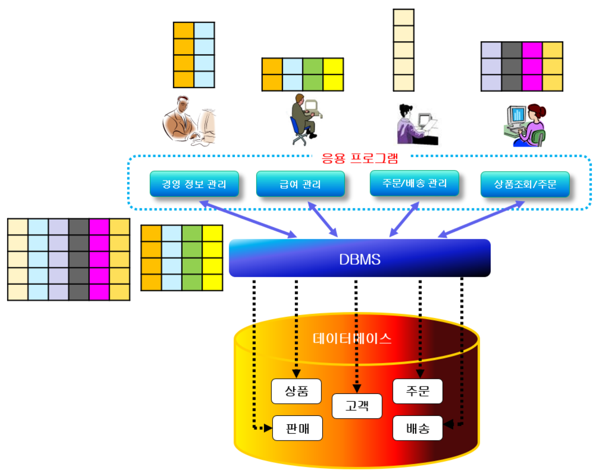

# 데이터베이스

* 목차
1. [데이터베이스 기본 개념](#데이터베이스-기본-개념)
2. 

# 데이터베이스 개요

## 데이터베이스 기본 개념

1. **데이터 Data**
    - 관찰이나 측정을 통해서 수집된 사실 facts나 값 value.
    - 정량적 또는 정성적인 _실제 값_
	- 이를 가공해서 다양한 일을 할 수 있다.
	- 소식이나 정보를 정할 수 있고, 통찰력있는 정보를 뽑아낼 수 있다.

	 

2. **정보 Information**
    - 의사결정에 도움이 되도록 데이터를 의미 있는 패턴으로 정리한 것
    - __데이터에 의미를 부여한 것__

 

## 데이터구조

* __논리적 구조 (logical organization)__
    - 사용자의 관점에서 본 데이터의 개념적 구조
    - 데이터의 논리적 배치
    - 논리적 레코드
- __물리적 구조 (physical organization)__
    - 저장 관점에서 본 데이터의 물리적 배치
    - 저장장치에 저장된 데이터의 논리적 배치
    - 물리적 레코드

* 데이터 베이스
	+ 데이터의 집합체로서
	+ 조직에 필요한 정보를 얻기 위해
	+ 논리적으로 연관된 데이터를 모아
	+ 구조적으로 통합한 내용
	+ 여러 사용자나 응용프로그램이 공유하고, 동시에 접근이 가능하다.

 

## 데이터베이스 관리 시스템 DBMS

- 데이터베이스를 관리해주는 소프트웨어 시스템
- Oracle, MS SQL Server, MySQL…

 

## 데이터베이스 시스템
> 통합된 데이터를 관리, 처리 및 사용자에게 서비스하기 위한 전체 시스템

* 아래를 포괄하는 개념
	- 데이터베이스 DB
	- 데이터베이스 관리 시스템 DBMS
	- 데이터 언어 Data Language
	- 사용자 User
	- 데이터베이스 관리자 DBA
	- 데이터베이스 컴퓨터 Database Computer
	- 시스템 System
* 데이터베이스 시스템의 구조

## 데이터베이스 / DBMS 특징
 * 데이터 공유
	- 필요한 자료를 한 번만 데이터베이스에 저장하고
	- 모든 응용 프로그램 (사용자)가 공유
	- 데이터 중복 방지, 최신 데이터 유지, 일관성 보장
    
* 데이터 중복의 최소화
	- 동일한 데이터가 여러 개 중복되어 저장되는 것 방지
* 데이터의 독립성
	+ 데이터베이스 크기를 변경하거나 데이터 파일의 저장소 변경 시 기존에 작성된 응용 프로그램에는 영향을 미치지 않도록 데이터의 독립성 보장

* 데이터의 안정성 향상
	- 대부분의 DBMS가 제공하는 백업, 복원 기능 이용
	- 데이터가 손상되는 문제가 발생할 경우 원상으로 복원, 복구하는 방법이 명확해짐
* **데이터의 무결성 Integrity**
	- 데이터베이스 안의 데이터는 오류가 없어야 하고
	- 데이터베이스에 저장된 데이터 값과 표현하는 현실 세계의 실제값이 일치해야 함
	- 데이터 상호간에 모순성이 없고, 현실 세계에 모순되지 않도록 데이터 유지
	- 무결성 제약 조건
		- 무결성을 보장하기 위해 정확하지 않은 것은 데이터가 데이터베이스 내에 저장되는 것을 방지하기 위한 제약 조건

> 데이터베이스 시스템에서는 이러한 오류를 방지하기 위해 외래키를 사용하여 데이터간(테이블 간) 모순성 배제한다.

- 보안
    - 데이터베이스의 테이블에 따라 접근 권한 다르게하여 데이터베이스의 비밀 유지와 조작 방지

- 데이터 추상화
    - 데이터베이스에서는 사용자에게 저장구조의 복잡성을 숨기고
    - 테이블 개념만으로 DB를 생성/관리할 수 있도록 지원
    
- 다양한 뷰 제공
    - 다양한 형태(뷰)로 사용자에게 필요한 DBMS 데이터 세트 제공
    - 수천가지의 뷰 정의 가능
    - 사용자 편의성 제고
    - 보안 및 권한 관리

