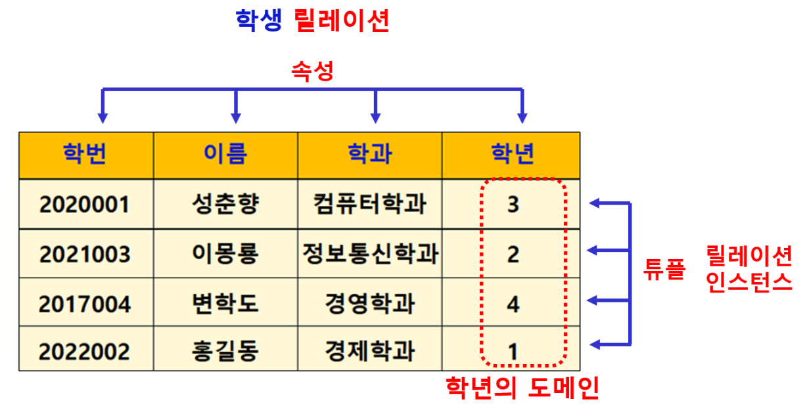

# 관계형 데이터베이스 용어

## 관계형 데이터 모델
- 데이터를 2차원 테이블 형태인 릴레이션 구조로 표현하는 논리적 데이터 모델

### 릴레이션
- 관계형 데이터 구조
- 데이터를 원자값으로 갖는 2차원 테이블로 표현
- 논리적 구조이므로 다양한 정렬 기준을 통하여 릴레이션 표현 가능

### 릴레이션 스키마 relation schema
- 릴레이션에 데이터를 넣을 수 있도록 하는 릴레이션 틀
- 릴레이션 이름, 속성 이름, 속성값의 도메인 정의

### 속성 Attribute : 필드, 컬럼, 열
- 데이터베이스를 구성하는 가장 작은 논리적 단위
- 개체의 특성, 상태 등 기술
- 파일 구조의 데이터 필드에 해당
- ex. 학번, 이름, 학과, 학년 …

### 도메인 Domain

- 릴레이션에서 하나의 속성이 취할 수 있는 같은 타입의 원자값들의 집합
- 실제 속성값이 나타날 때 속성값의 적법 여부를 검사하는데 이용

### 릴레이션 스키마 표현

- 릴레이션 이름 (속성1, 속성2, 속성3…)
    - 예시 : 학생 (학번, 이름, 학과, 학년)

### 릴레이션 인스턴스
- 어느 시점의 릴레이션에 들어있는 튜플(row)들의 집합
- 동적 성질 (삽입, 삭제, 갱신으로 시간에 따라 변함)

### 튜플 Tuple

- 릴레이션의 행(Row) : 데이터행
- 릴레이션 내의 모든 튜플(행)은 서로 중복되어서는 안됨 : 전체 똑같은 행은 저장 안됨. 구별 가능해야함.

