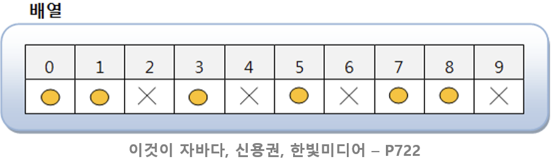
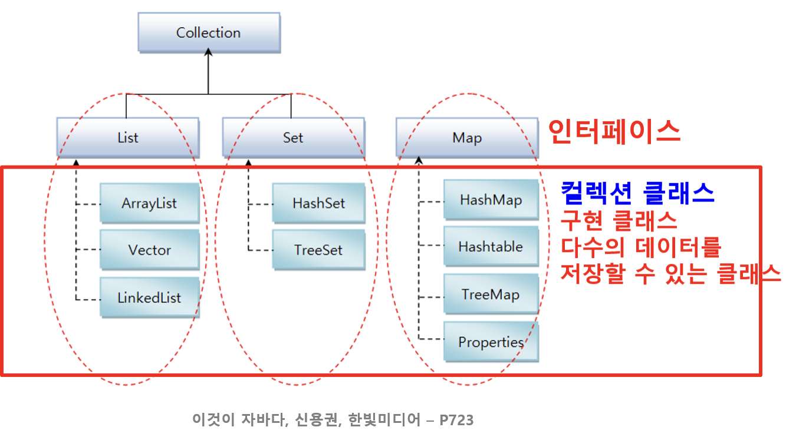

# 📃 Java: 컬렉션 프레임워크 Collection Framework

- 컬렉션 Collection
  - 사전적 의미로 요소(객체)를 수집해 저장하는 것, 모아 놓은 것
- 프레임워크
  - 표준화, 정형화된 체계적인 프로그래밍 방식
  - 미리 정해진 방식대로 프로그램을 작성
  - 누가 작성하든지 프로그램이 표준화되기 때문에 프로그램을 유지보수하기 쉬워짐

## 여러 개의 값을 저장해서 사용하는 구조 : 배열

- 애플리케이션 개발 시 다수의 객체를 저장해 두고 필요할 때 꺼내서 사용하는 경우에 가장 간단하게 사용하는 방법
- 배열의 문제점

  - 생성 시 크기 고정되고 사용 시 크기 변경 불가
    - 불특정 다수의 객체를 저장하기에는 문제
  - 객체 삭제했을 때 해당 인덱스가 비게 됨
  - 객체를 저장하려면 어디가 비어있는지 확인해야 하는 코드 필요

- **해결책 == 컬렉션 프레임워크**

---

# 컬렉션 프레임워크 (Collection Framework)

- 컬렉션(다수의 객체)을 다루기 위한 표준화된 프로그래밍 방식
  - 많은 양의 데이터를 저장, 삭제, 검색, 비교, 정렬 등의 작업을 편리하고 쉽게 수행
- 객체들을 효율적으로 추가, 삭제, 검색 등을 할 수 있도록 제공되는 컬렉션 라이브러리
- 인터페이스를 통해서 정형화된 방법으로 다양한 컬렉션 클래스 이용
- `java.util.*` 패키지에 포함

## 컬렉션 클래스

- 다수의 데이터를 저장할 수 있는 클래스
  - 예 : ArrayList, Vector, HashSet, HashMap, ….

## 컬렉션 프레임워크의 주요 인터페이스

## List / Set / Map 인터페이스
