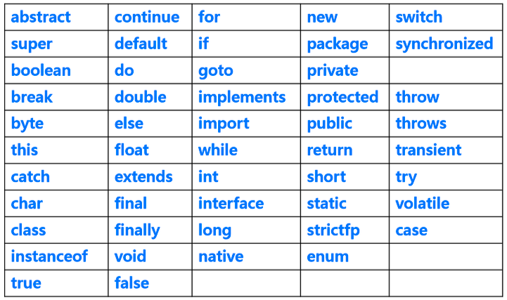

# 변수의 작성 규칙

- 첫 번째 글자는 문자이거나 $,_여야 하고 숫자로 시작할 수 없다.
- 영어 대소문자가 구분된다.
- 첫 문자는 영어 소문자로 시작하되, 다른 단어가 붙을 경우 첫자를 대문자로 한다.(관례)
- 문자수(길이)의 제한은 없다.
- 자바 예약어(키워드)는 사용할 수 없다.
    - 자바 시스템에서 지정하여 사용하는 단어 : 이미 맡아놓은 단어
    - 클래스명, 메소드명, 각종 변수명으로 사용할 수 없음.
    - 예약어는 모두 소문자로 되어있음.


```java
carBodyColor : 자바
car_body_color : 파이썬

// !! 주의 !! 변수 이름 사이에 공백을 포함할 수 없다.
```