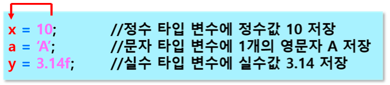

# 변수의 선언
- 변수를 사용하기 위해서는 반드시 변수를 선언해야 한다.
- 선언하지 않으면 오류 발생
    - cannot be resolved to a variable
- 변수를 선언하는 이유
    - 실행 중에 필요한 공간 할당 받기 위

```jsx
int b=100;
b=300;
System.out.println(b);
```
### 선언 형식

- 데이터타입 변수명 ;
- int a; // 선언만 하고 값을 초기화 하지 않은 경우
    - 정수타입 변수 선언
    - 정수값을 저장하기 위해 a라는 이름으로 변수 선언
    - 그러면 컴파일러가 정수를 저장할 크기 4byte 크기의 저장공간을 확보
- int age;
- int b = 100; //선언과 동시에 초기화(값을 미리 넣어둠)
- 1개의 문자를 저장하기 위한 변수 선언
    - char c;
        - 문자타입 변수 c 선언 : 2 byte
- 실수를 저장하기 위한 변수 선언
    - 작은 실수 float f; : 4byte
- 선언된 변수에 값 저장
    - 변수명 = 값;
    - 저장소 = 값;
    - 대입 연산자 =우항의 값을 좌항의 저장소에 저장



## 변수 초기화

- 변수 선언과 동시에 값 저장

```jsx
int a = 100;
char b = 'x', c = 'y';
double score = 12.34;
float average = 93.5f;
boolean start = false;
```

## 주의

- 초기화 되지 않은 변수는 사용시 오류 발생

```java
int value; // 선언만하고 초기화 안했음
int result = value +10;

/* 변수 value에 10을 더한 결과를 변수 result에 저장
오류 발생 : value가 초기화 되지 않았다고 오류 발생
The local variable value may not have been initiallized
*/

int value = 30; // 초기화 한 후
int result = value + 10; // 변수 사용
```