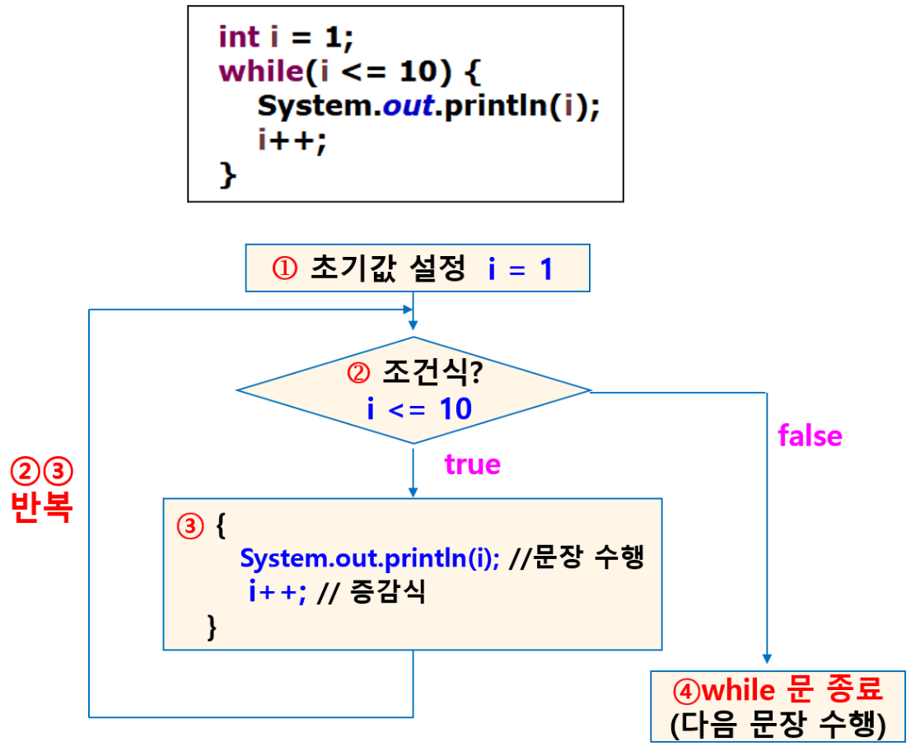

# while 문

- 조건에 따라 반복을 계속할지 결정할 때 사용
- 조건식이 true일 경우 계속해서 반복
- (for문은 정해진 횟수만큼 반복)

## 형식

```java
while (조건식) {
	(조건식의 결과가 true일 때 반복되는 수행 문장)
	(증감)
}
다음 문장
```

## 수행 순서



- 주의
    - 초기값이 없으면 조건을 알 수 없고
    - 증감식이 없으면 반복문을 빠져나올 수 없어서 무한 반복
    - i가 증가하지 않으면 계속 10이하로 조건이 계속 true상태 → 무한 반복

### while 무한 루프

- 조건이 무조건 true
- 초기값
- 종료조건
- 종료되기 위한 증감 값이 필요함