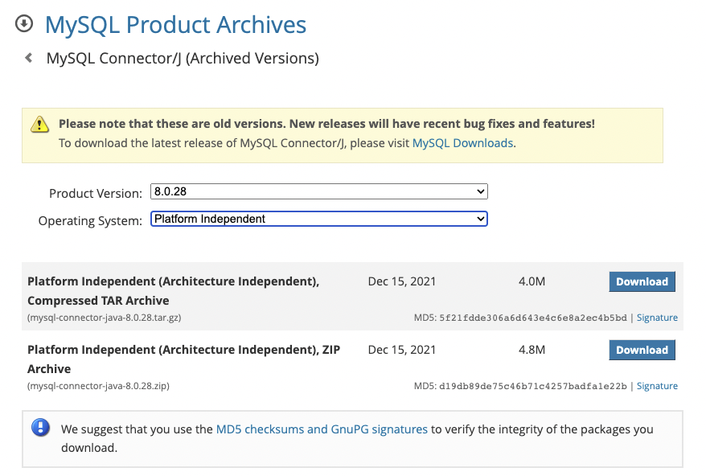
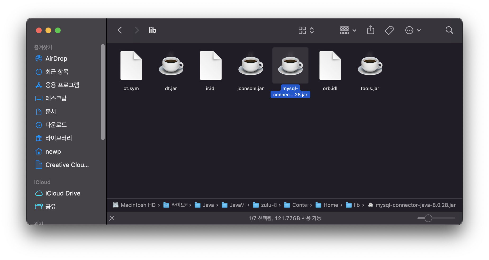
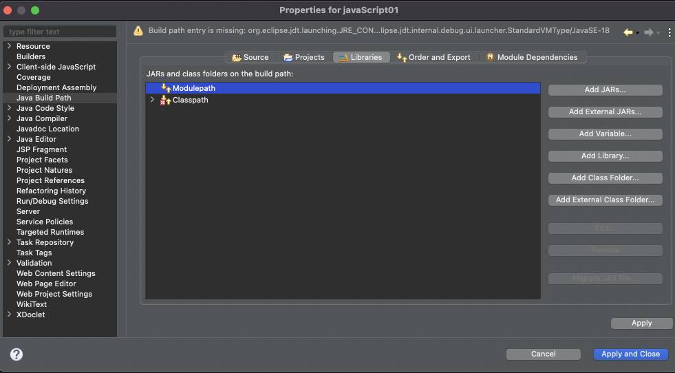
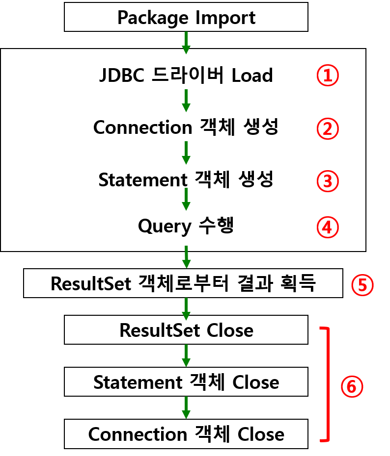

# [JDBC] Eclipse와 MySQL 연결하기
* 목차
1. [사전 준비](#사전-준비)
2. [JDBC를 이용한 연결](#jdbc를-이용한-연결과정)
    - [드라이버 로드](#1-드라이버-로드)
    - [Connection 객체 생성](#2-connection-객체-생성)
    - [Statement 객체 생성](#3-statement-객체-생성)
    - [ResultSet 객체 생성 및 결과 획득](#4-resultset-객체-생성-및-결과-획득)
    - [쿼리 수행](#5-쿼리-수행)
    - [객체 close](#6-모든-객체-close)

---

## 사전 준비
### 0. JDBC 드라이버 다운로드
1. 사이트 접속
    - [MySQL Community Downloads](image/https://dev.mysql.com/downloads/connector/j/)

2. 최신 버전은 불안정하므로, `Archives` 탭을 눌러 원하는 버전을 선택한다.
    - `Operating System`은 `Platform Independent`를 선택하면 된다. 어차피 압축 파일이라 크게 상관없다.
    - 맥북을 쓰고 있는 나는 tar.gz 파일로 다운받았다.


3. 다운받은 파일의 압축을 풀고, 자바 폴더 하단 경로 중 `lip` 폴더에 넣어주면 된다.
    - 나의 경우, `mysql-connector-java-8.0.29.jar`를 다운받았고 폴더에 넣어주었다.
```
// 이름은 다를 수도 있다.
/Java/JavaVirtualMachines/zulu-8.jdk/Contents/Home/lib
```



### 자바 프로젝트 생성 및 라이브러리 추가
1. 이클립스에서 Java Project 생성한다.
2. 프로젝트 이름에서 우클릭 - `Properties`
3. `Java Build Path` - `Libraries` 탭
4. `Modulepath` 선택 후, `Add external jars...` 선택



5. 아까 다운 받은 jar 파일을 찾아서 열고, Apply 한다.

---

## JDBC를 이용한 연결과정

- 한 개의 클래스 (java.sql.DriverManager) 사용
- 두 개의 인터페이스 (java.sql.Driver, java.sql.Connection) 사용

- 해당 패키지는 이미 JDBC에 모두 포함되어 있어 import만 하면 된다.

<br>

### 1. 드라이버 로드
- Java에서 MySQL Driver를 사용하기 위해 드라이버를 JVM에 로딩하는 과정
- 동적으로 MySQL JDBC Driver 클래스의 객체를 생성하여 런타임시 메모리에 로딩
```java
Class.forName("com.mysql.cj.jdbc.Driver");
```

<br>

### 2. Connection 객체 생성

* DB연결하기 위해 DriverManager의 Connection 객체 생성
* MySQL 서버에 연결하기 위해 url, 유저명, 비밀번호를 함께 전송

```java
String url = "jdbc:mysql://localhost:3306/sqldb3?serverTimezone-UTC";
String user = "유저명";
String pwd = "비밀번호";

con = DriverManager.getConnection(url,user,pwd);
```

- `jdbc:mysql` : JDBC 드라이버
    - `jdbc` : JDBC URL의 프로토콜 이름
    - `mysql` : MySQL JDBC 드라이버
- `localhost` : MySQL이 설치된 IP (호스트이름)
    - localhost
    - 127.0.0.1
- `3306` : MySQL 접속 포트
- `sqldb3` : 사용하는 데이터베이스(스키마) 이름

---

* Connection 객체 생성시 DB 연결 성공
* Try/catch 구문도 체크

```java
if(con != null) {
        System.out.println("DB 연결 성공");
    }
```

<br>

### 3. Statement 객체 생성
> Query 작성 및 실행

```java
// 쿼리 문 작성
String sql = "select * from student order by stdNo";

// 객체 생성
PreparedStatement pstmt = con.prepareStatement(sql);
    
// 쿼리 실행
ResultSet rs = pstmt.executeQuery();
```

### 4. ResultSet 객체 생성 및 결과 획득
> (SQL문에 결과 반환이 있는 경우)

### 5. 쿼리 수행
### 6. 모든 객체 close()