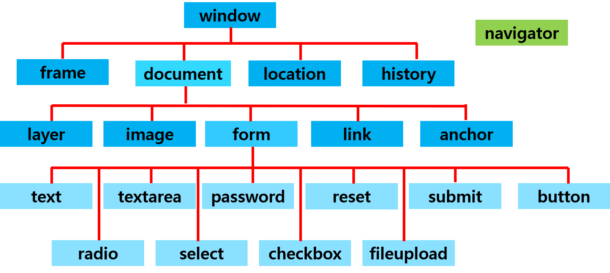

# 브라우저 객체 모델 (Browser Object Model)
> 웹 브라우저를 대상으로 이루어진 객체를 뜻한다.

-  자바 스크립트에서는 웹 페이지를 구성하는 HTML 태그의 모든 요소와 웹 브라우저를 구성하는 요소들을 객체로 정의하여 제공한다.

## 종류
- window : 창
- document : 문서
- history : 웹 브라우저의 기록 정보
- location : 주소 정보
- navigator :  웹 브라우저의 종류 정보

