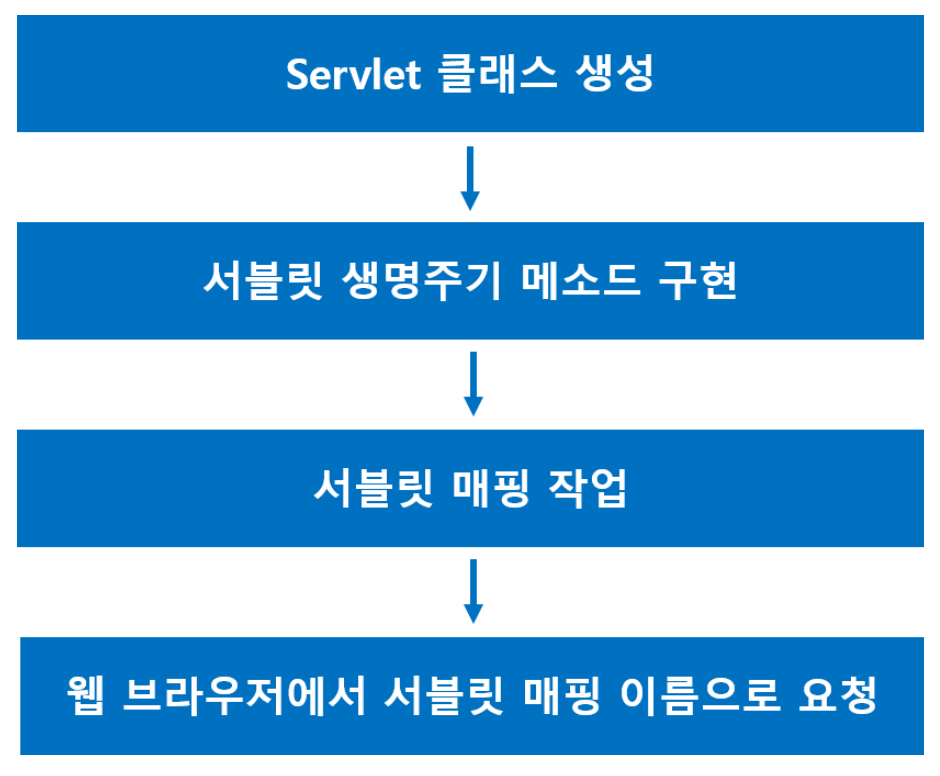
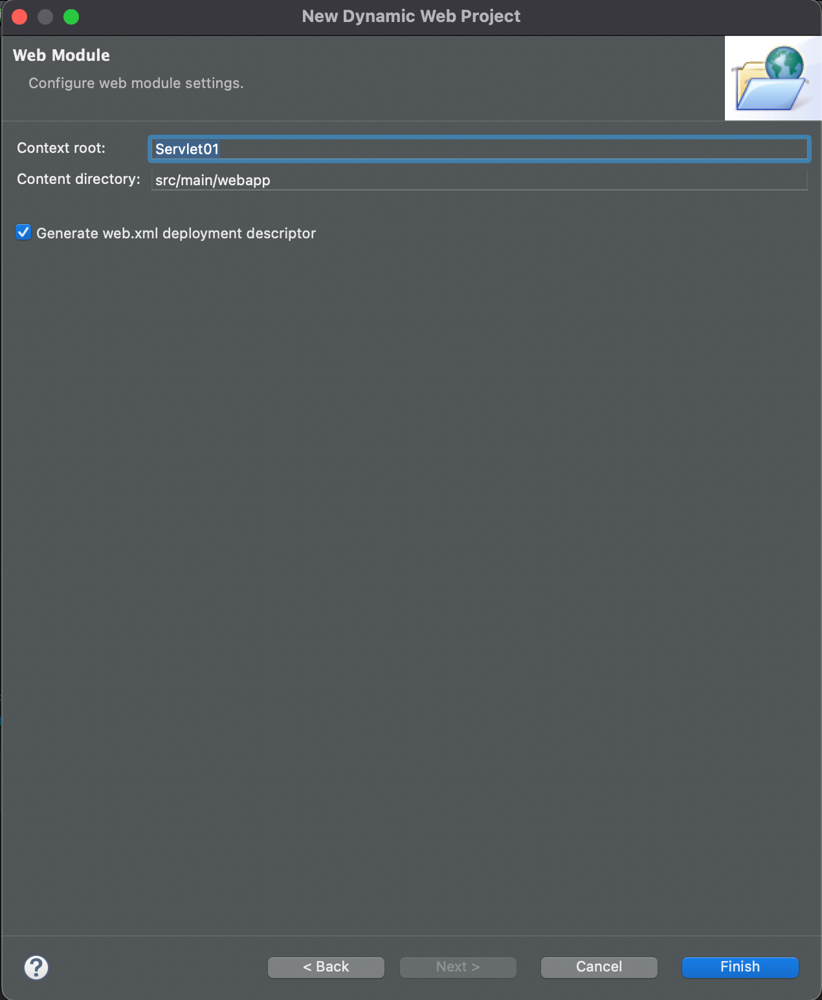

# Servlet 만들어보기

## 왜 서버 응용프로그램을 Servlet이라  명칭할까?

- 각 기능별로 필요에 따라 나누어져있다.
- 모든 것을 한번에 개발할 필요가 없고, 필요한 것 하나씩 만들기

## Servlet 생성 과정



### 서블릿 맵핑(Mapping)이란?
- 서블릿 경로 연결
- 파일 경로 노출로 인한 보안 문제를 없애고
- url을 간단하게 줄일 수 있다.
- 웹 브라우저에서 서블릿을 요청하기 위해서는 반드시 필요하다.
- 설정방법
    1. web.xml 에서 설정
    2. 어노테이션 @ 사용
        - 이클립스에서 자동 지정
        - 자동 지정된 이름에서 변경 가능

---

## Servlet 만들기
> 환경 : eclipse, Tomcat8

### 1. Servlet project 생성
- New - Dynamic Web Project 생성
    - 생성시 `Generate web.xml` 체크



### 2. 패키지 생성
- src/main/java 폴더에 패키지 추가

### 3. 클래스 생성
- 패키지 안에 서블릿 추가
- New - Servlet

<br>

## eclipse 프로젝트에서 서블릿을 사용하기 위한 세팅
- 프로젝트 Properties - Libraries 탭에서
- Classpath 경로에서 [Add External JARs] 누르기
- `apache-tomcat-9.0.64/lib` 에 있는 servlet-api.jar 추가

## 프로젝트 실행 결과 확인
- 실행시 url
    - 맵핑을 안했다면, Sevlet 파일명이 초기값
```
http://localhost:8080/프로젝트명/맵핑명
```
- 콘솔창 출력 내용 : 각 메소드 내용을 수정하여 확인한다.
    1. 처음 실행시 초기화된 후 doGet()메소드 호출
        - init 메소드 호출
        - doGet 메소드 호출
    2. 웹 프라우저 새로고침하면 초기화는 안되고, doGet() 메소드만 호출
        - init 메소드 호출
        - doGet 메소드 호출
        - doGet 메소드 호출
    3. 서블릿 수정하고 저장한 후 조금 기다리면 콘솔창에 destroy() 메소드 호출

---

# 참조
- mlp 강의 정리

# 연관글
- [Servlet 기본 개념](Servlet.md)
- [Servlet mapping 방법]([servlet]mapping.md)