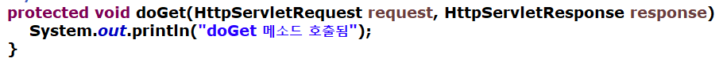
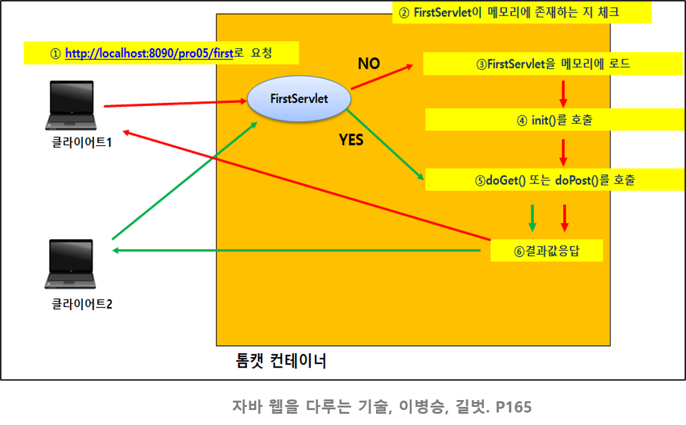

# [Servlet] 요청 처리 객체 request / 응답 처리 객체 response

- 톰캣에서 request 객체와 response 객체 생성해서 doGet() 메소드 안에 인자 값으로 넣어 준다.
- request 객체 : 요청 처리 객체
  - 클라이언트에서 입력한 데이터가 request 객체에 담겨서 서버로 전달
- response 객체 : 응답 처리 객체
  - 서버 측에서 처리한 결과를 response 객체에 담아 클라이언트로 전달
- doGet()과 doPost() 메소드 둘 다 매개변수로 request/response 객체를 가진다.

# 서블릿 동작 과정

- URL로 요청
- Servlet이 메모리에 존재하는지 체크
- 없으면 Servlet을 메모리에 로드
- init() 메소드 호출
- doGet() 또는 doPost() 메소드 호출
  - method를 지정하지 않으면 doGet() 호출이 디폴트
- 클라이언트에게 결과 응답

