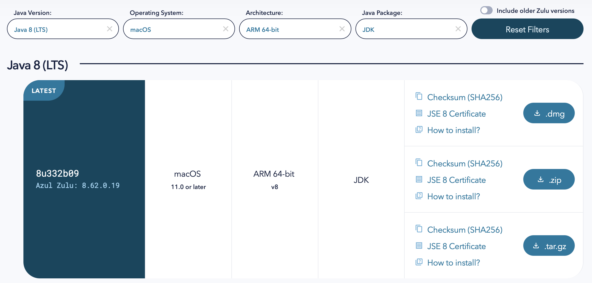
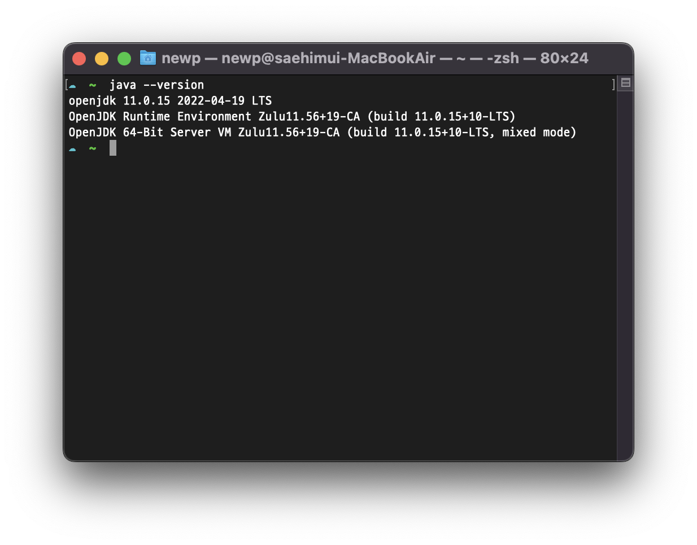

# 맥북(M1)에서 JDK 설치 및 환경 변수 설정하기

* 목차
    1. [JDK란?](#jdk란)
    2. [JDK 설치 방법](#jdk-설치-방법)
    3. [환경변수 설정](#환경변수-설정)
        + [환경변수란?](#환경변수란)

---
> 설치 환경 : macOS m1

 

## JDK란?
> **The Java Development Kit (JDK)** is one of three core technology packages used in Java programming, along with the _JVM (Java Virtual Machine)_ and the _JRE (Java Runtime Environment)_.

* The **JVM** is the Java platform component that executes programs.
* The **JRE** is the on-disk part of Java that creates the JVM.
* The JDK allows developers to create Java programs that can be executed and run by the JVM and JRE.

 

## JDK 설치 방법

1. azul에서 JDK `Download now` 클릭
2. 하단에 `Download Azul Zulu Builds of OpenJDK` 세팅 후 `.dmg` 다운로드
> (예시)
> - Java Version = Java 8
> - Operating System = macOS
> - Architecture = ARM 64-bit
> - Java Package = JDK

3. JDK 파일 실행 후, pkg 파일 더블 클릭하여 설치

4. `command`+`space` 눌러 `Spotlight`에서 `Terminal`을 검색하여 실행

5. `java -version`명령어를 입력하여 설치된 자바 버전을 확인할 수 있다.

 

## 환경변수 설정
### 환경변수란?

* 있을 수 있는 에러
test