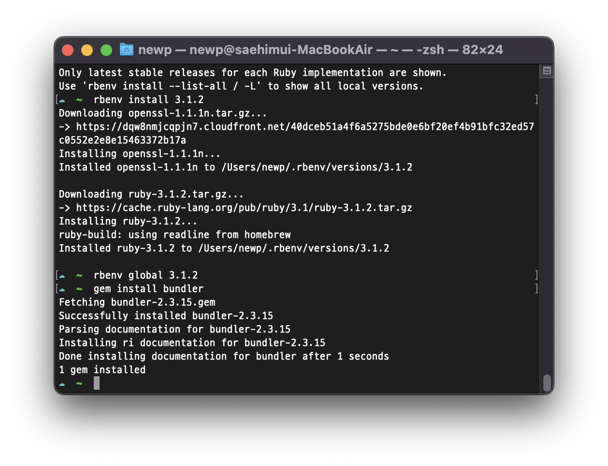

# github 활용을 위해 <br>맥북 m1에 ruby 설치하기

> homebrew 이용

## 선행조건
- homebrew 설치 및 업데이트

## 설치
### 1. 터미널 열기
### 2. rbenv 설치
```cmd
$ brew install rebenv ruby-build
```
* 설치 확인
```cmd
$ rbenv versions
```

<br>

### 3. rbenv로 루비 설치
* 설치가능 버전 확인
```
$ rebenv install -l
```

* 버전 설치

```
$ rebenv install 3.1.2
```

<br>

### 4. 기본버전 변경 및 환경변수 설정
* 버전 확인
```cmd
$ rbenv versions
```
* 기본버전을 설치한 버전으로 변경
```cmd
$ rbenv global 3.1.2
```

* 환경변수 설정
    + 본인의 쉘 설정 파일을 열어 다음의 코드를 추가
    + 쉘 설정파일은 터미널 상단을 보면 알 수 있다.(.zshrc 혹은 .bashrc)
    
{: width="50%" height="50%"}
```cmd
$ vim ~/.zshrc
```

*  ~/.zshrc에 추가
```cmd
[[ -d ~/.rbenv  ]] && \
  export PATH=${HOME}/.rbenv/bin:${PATH} && \
  eval "$(rbenv init -)"
```

### 5. 적용

```cmd
$ source ~/.zshrc
```

### 6. 패키지 설치
* 패키지 설치
```cmd
$ gem install jekyll bundler
```

* Gem 설치
```
$ gem install bundle
```

## 완료
아래와 같이 정상적으로 실행되는 것을 확인할 수 있습니다.

{: width="50%" height="50%"}

---
# 참고
- [맥북에 github를 위한 ruby 설치 및 셋팅 (21-05-13)](https://europani.tistory.com/295)
- [Mac에서 Gem::FilePermissionError 에러 발생시 해결 방법 (18-04-24)](https://jojoldu.tistory.com/288)
- [맥에서 깃허브 Jekyll 블로그 설치 방법 (20-09-24)](https://qanondev.tistory.com/1)
