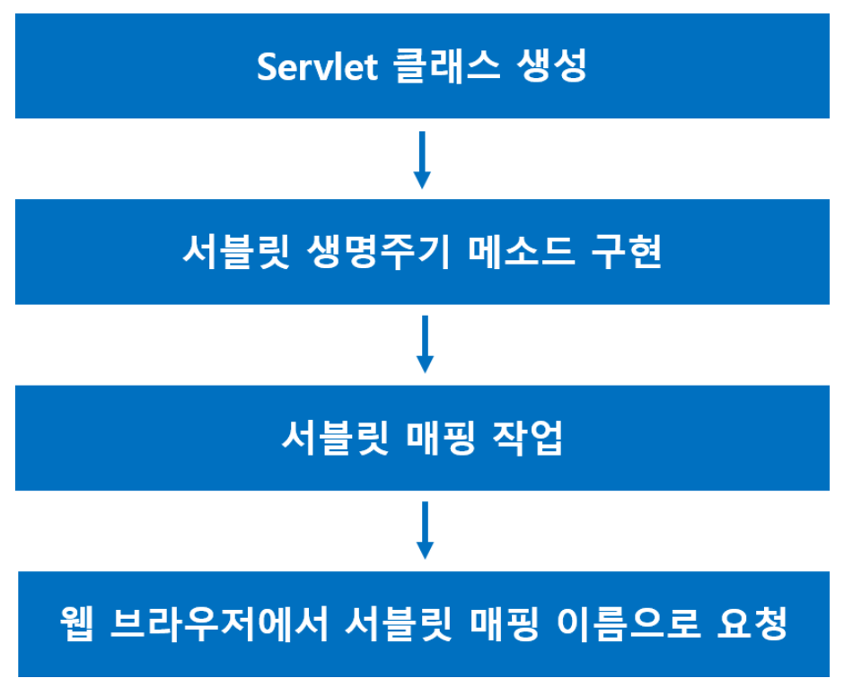
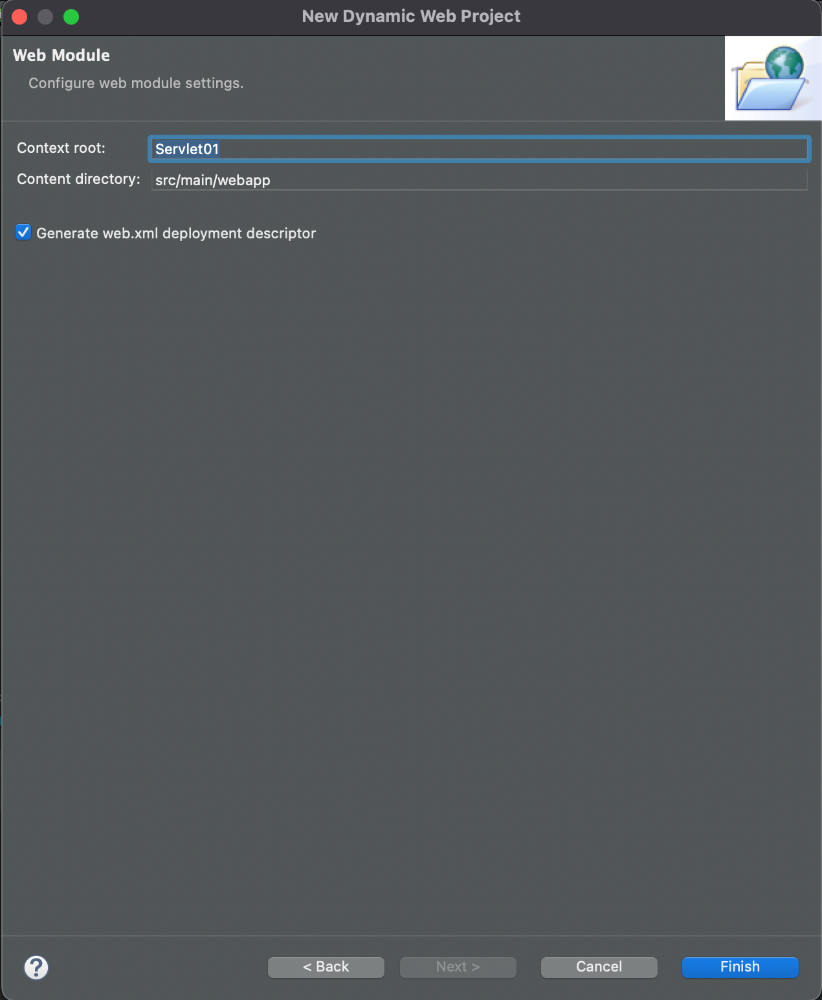

# Servlet 만들어보기

## 왜 서버 응용프로그램을 Servlet이라  명칭할까?

- 각 기능별로 필요에 따라 나누어져있다.
- 모든 것을 한번에 개발할 필요가 없고, 필요한 것 하나씩 만들기

## Servlet 생성 과정

### 서블릿 맵핑(Mapping)이란?
- 서블릿 경로 연결
- 파일 경로 노출로 인한 보안 문제를 없애고
- url을 간단하게 줄일 수 있다.
- 웹 브라우저에서 서블릿을 요청하기 위해서는 반드시 필요하다.
- 설정방법
    1. web.xml 에서 설정
    2. 어노테이션 @ 사용
        - 이클립스에서 자동 지정
        - 자동 지정된 이름에서 변경 가능

---

## Servlet 만들기
> 환경 : eclipse, Tomcat8

### 1. Servlet project 생성
- New - Dynamic Web Project 생성
    - 생성시 `Generate web.xml` 체크

