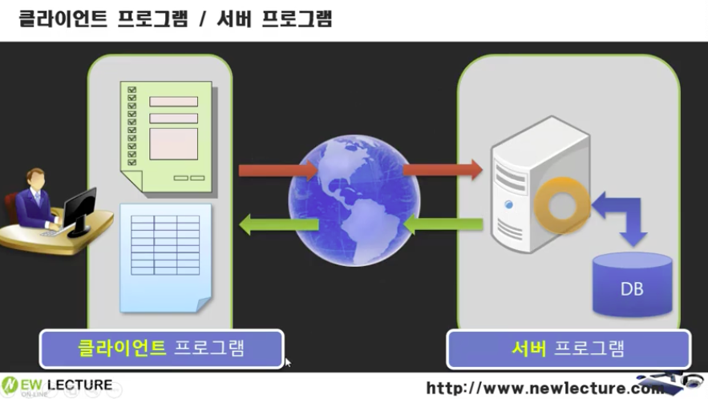
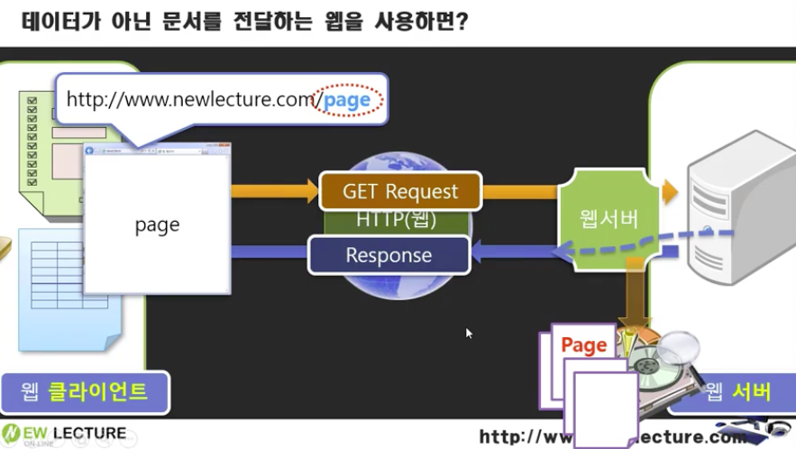

# Web 개념 : 웹 프로그래밍의 이해
## 1. 웹 서비스
> 인터넷을 기반으로 제공되는 서비스

## 2. 웹 애플리케이션
> 웹을 기반으로 작동되는 프로그램. 웹 프로그래밍을 통해 구현

## 3. 웹 프로그래밍의 개요
- 웹 프로그래밍은 기본적으로 클라이언트(Client) / 서버(Server) 방식
- 정적인 HTML만으로는 데이터가 실시간으로 변화하는 것을 처리하거나 저장하기에는 불가능하다.
- 동적으로 변화하는 데이터를 처리하고 표시하기 위해 개발된 언어들이 CGI, ASPm PHP,JSP,Sevelet 등이다.
- 정적 웹 프로그래밍과 동적 웹 프로그래밍이 있다.

 

### 1) 정적 웹 프로그래밍
- 웹서버에 미리 보여줄 HTML 페이지, CSS, 이미지, 자바스크립트 파일 등을 저장해 놓고 브라우저에서 요청할 경우 그대로 전달하는 방식
- 사용자는 페이지가 변경되지 않는 한 고정된 웹 페이지를 보게 된다. (물론 페이지는 레이아웃 등이 동적으로 변경 가능하다.)
- 주로 화면의 디자인을 구성하거나 클라이언트의 이벤트를 처리함
- 실시간 데이터 처리 또는 데이터 저장 등을 표현하거나 다루는데 적합하지는 않다.

#### 정적 웹프로그래밍의 구성요소
- 클라이언트 (웹브라우저)
    + 인터넷으로 서버에 접속한 후 서버로부터 서비스를 제공받는 컴퓨터와 소프트웨어 (웹브라우저)

- 웹서버
    + 각 클라이언트로부터 요청을 받고 서비스를 제공하는 컴퓨터와 소프트웨어

- HTTP 프로토콜
    + Hyper Text Transfer Protocol
    + www(World Wide Web) 서비스를 제공하는 프로토콜을 이용해서 정보를 주고 받는다.
    + 통신 규약 : 통신을 위해 미리 정해놓은 규칙

- HTML
    + www 서비스를 제공하기 위한 표준 언어

- CSS
    + HTML 페이지의 디자인 관련 기능을 처리하기 위한 언어

- Javascript
    + HTML 웹페이지의 여러 가지 동적인 기능을 제공하기 위한 스크립트 언어

 

### 동적 웹프로그래밍
- 정적 웹 프로그래밍에서 관리자의 역할을 웹 애플리케이션 서버가 수행한다.
- 웹 애플리케이션 서버(Web Application Server) == **WAS**
- 클라이언트의 요청이 있을 때마다 데이터베이스(CRUD)에 접근해서 실시간 정보를 얻어와서 클라이언트에게 전송

#### 동적 웹프로그래밍의 흐름
1. 초기 동적 웹 프로그램에서 사용하는 방식
    - CGI (Common Gate Interface : 공용 게이트웨이 인터페이스)
        - 대표적인 CGI 언어 : 펄(Perl)
    - 프로세스 Process 방식으로 실행됨
    - 프로세스마다 메모리에 로드하는 방식으로, 메모리에 과부하 발생하는 문제가 발생했다.
2. JSP, ASP, PHP
    - 브라우저 요청 시 스레드 방식으로 실행하므로 CGI보다 효율적으로 기능을 수행함
    - 클라이언트 요구를 처리하는 기능은 최초 한 번만 메모리에 로드
    - 동일한 기능 요구 시 기존에 사용한 기능을 재사용
    - 따라서 프로세스 방식으로 동작하는 것보다 훨씬 빠르게 수행

 

## 4. 웹 서비스의 구성 요소
- 웹 브라우저
    + 클라이언트, 사용자의 작업 창
- 웹 서버
    + 웹 브라우저의 요청을 받아들이는 곳
- 웹 애플리케이션 서버 WAS
    + 요청된 페이지의 로직 및 데이터베이스와의 연동을 처리하는 부분
- 데이터베이스 : 데이터의 저장소

### 웹 서버
> 웹에서 서버 기능을 수행하는 프로그램
- HTTP 프로토콜 기반
- 웹 클라이언트(웹브라우저)로부터 요청을 서비스(제공)하는 기능 담당
- 정적인 콘텐츠(HTML, jpg, css 등) 제공
- 동적인 콘텐츠(데이터 처리) 요청은 웹 컨테이너(WAS에 포함)에게 보내고, 웹 컨테이너가 처리한 결과를 클라이언트에게 응답
- 웹 서버의 종류
    - Apache (리눅스/유닉스/윈도우)
    - IIS : Internet Information Server (윈도우)

### 웹 컨테이너 Web Container
> 웹 애플리케이션을 실행할 수 있는 컨테이너
- JSP와 Servlet(서블릿)을 실행시킬 수 있는 소프트웨어
- 웹 서버가 서블릿 자체를 실행하지 못하므로 JVM을 내장한 컨테이너라는 서블릿 실행 환경이 필요
- 서블릿과 JSP에 대한 실행 환경 제공
- 물론, Static Page (정적 페이지)에 대한 요청도 처리 가능
- 웹 서버에서 JSP를 요청하면 tomcat(웹서버+컨테이너)에서 JSP 파일을 서블릿으로 변환하여 컴파일을 수행 후 서블릿 수행 결과를 웹 서버에게 전달 → 클라이언트에게 전달
- 웹 애플리케이션 당 하나의 Sevlet Context 객체 생성

> **웹 컨테이너가 사용자의 요청에 응답하는 순서**
>
> 1. 클라이언트가 HTTP request를 HTTP service(웹서버)에게 전송
> 2. 웹 서버가 요청 데이터를 웹 컨테이너에게 전송
> 3. 웹 컨테이너는 HttpServletRequest 객체와 HttpServletResponse 객체 생성
> 4. 웹 컨테이너는 요청된 Servlet의 service() 메소드를 호출하여 Servlet을 활성화 시킴
> 5. 웹 컨테이너는 Servlet에 의해 생성된 응답 데이터를 웹 서버(HTTP service)에게 전송
> 6. 웹 서버는 Http response를 클라이언트에게 전송

### 웹 애플리케이션 서버 WAS
> 웹 서버로부터 오는 동적인 요청을 처리하는 서버
- 웹 서버 기능 + 웹 컨테이너 기능
- 기타 기능
    - 트랜잭션, 보안, 트래픽 관리, DB 커넥션 풀, 사용자 관리 등 다양한 기능 제공
- Apache Tomcat은 WAS에 해당

---
# 참조
- mlp 수업 정리
- [뉴렉처 - 서블릿/JSP 강의](https://www.youtube.com/watch?v=FZuQ7DyhRfQ&list=PLq8wAnVUcTFVOtENMsujSgtv2TOsMy8zd&index=2)